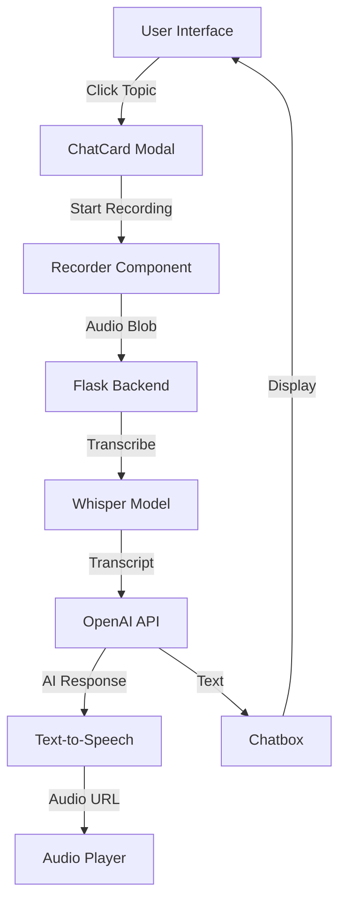

## Overview

EliteCode is a voice-enabled data structures learning platform built with a modern full-stack architecture. The application uses a separated frontend/backend approach with Next.js for the client and Flask for the speech-to-text service.

## Technology Stack

<CardGroup cols={2}>
  <Card title="Frontend" icon="react">
    - **Framework**: Next.js 14.1.3
    - **UI Library**: React 18.2.0
    - **Language**: TypeScript 5
    - **Styling**: Tailwind CSS 3.3.0
    - **Animations**: Framer Motion 11.0.25
    - **Components**: Radix UI
  </Card>

  <Card title="Backend" icon="python">
    - **Framework**: Flask
    - **Speech-to-Text**: OpenAI Whisper
    - **Device Support**: CUDA/CPU
    - **CORS**: flask_cors
  </Card>

  <Card title="AI Services" icon="brain">
    - **LLM**: OpenAI GPT-3.5-turbo
    - **Voice Input**: Whisper (base model)
    - **Text-to-Speech**: OpenAI TTS API
  </Card>

  <Card title="Media" icon="microphone">
    - **Recording**: MediaRecorder API
    - **Audio Format**: WebM
    - **Visualization**: Canvas API
  </Card>
</CardGroup>

## Project Structure

```
elitecode/
├── src/
│   ├── components/          # React components
│   │   ├── BentoGrid.tsx   # Main grid layout
│   │   ├── Navbar.tsx      # Navigation component
│   │   ├── Recorder.tsx    # Audio recording component
│   │   ├── ModulePopup.tsx # Chat modal (ChatCard)
│   │   └── ui/
│   │       └── Homepage.tsx # Main homepage component
│   ├── ion/                # Custom UI components
│   │   ├── Chatbox.tsx     # Message container
│   │   ├── Message.tsx     # Individual messages
│   │   ├── Button.tsx      # Button components
│   │   └── types.tsx       # TypeScript type definitions
│   ├── pages/              # Next.js pages
│   │   ├── _app.tsx        # App wrapper
│   │   ├── _document.tsx   # HTML document
│   │   └── api/            # API routes
│   │       ├── openai.ts   # OpenAI integration
│   │       └── textToSpeech.ts
│   ├── python/             # Python backend
│   │   └── app.py          # Flask server + Whisper
│   ├── styles/             # Global styles
│   ├── utils/              # Utility functions
│   └── services/           # External service integrations
├── public/                 # Static assets
├── package.json            # Node dependencies
├── requirements.txt        # Python dependencies
├── next.config.mjs         # Next.js configuration
├── tailwind.config.ts      # Tailwind configuration
└── tsconfig.json           # TypeScript configuration
```

## Application Flow

<Steps>
  <Step title="User Interaction">
    User clicks on a data structure topic card (e.g., "array", "linked list") on the homepage.
    
    Component: `Homepage.tsx` (src/components/ui/Homepage.tsx:1)
  </Step>

  <Step title="Modal Opens">
    A `ChatCard` modal popup appears, displaying the topic and recorder interface.
    
    Component: `ModulePopup.tsx` (src/components/ModulePopup.tsx:1)
  </Step>

  <Step title="Voice Recording">
    User clicks the microphone icon to start recording their explanation.
    
    Component: `Recorder.tsx` (src/components/Recorder.tsx:1)
    
    The `MediaRecorder` API captures audio in WebM format and displays a real-time audio visualizer using Canvas.
  </Step>

  <Step title="Audio Upload">
    When recording stops, the audio blob is sent to the Flask backend:
    
    ```typescript
    const response = await fetch(
      `${process.env.NEXT_PUBLIC_API_URL}/whisper`,
      {
        method: "POST",
        body: formData,
      }
    );
    ```
  </Step>

  <Step title="Speech-to-Text (Whisper)">
    The Flask backend receives the audio and transcribes it using OpenAI Whisper:
    
    ```python
    # src/python/app.py:39
    result = model.transcribe(temp.name)
    ```
    
    Returns: `{ "results": [{ "filename": "audio", "transcript": "..." }] }`
  </Step>

  <Step title="OpenAI Analysis">
    The transcript is sent to GPT-3.5-turbo for evaluation:
    
    ```typescript
    // src/pages/api/openai.ts:9
    openai.chat.completions.create({
      messages: [{ 
        role: 'user', 
        content: "The user is explaining this topic, explain if it is a good explanation or not:" + prompt 
      }],
      model: 'gpt-3.5-turbo',
      max_tokens: 50,
    });
    ```
  </Step>

  <Step title="Text-to-Speech">
    The AI response is converted to audio using OpenAI's TTS API and played back to the user.
    
    API: `textToSpeech.ts` (src/pages/api/textToSpeech.ts:1)
  </Step>

  <Step title="Display Response">
    The conversation is displayed in the `Chatbox` component.
    
    Component: `Chatbox.tsx` (src/ion/Chatbox.tsx:1)
  </Step>
</Steps>

## Data Flow Diagram



## Key Configurations

### Next.js Configuration

```javascript next.config.mjs
const nextConfig = {
  images: {
    remotePatterns: [
      {
        protocol: "https",
        hostname: "i.imgur.com",
      },
    ],
    domains: ["pbs.twimg.com"],
  },
};
```

### TypeScript Path Aliases

```json tsconfig.json
{
  "compilerOptions": {
    "paths": {
      "@/*": ["./src/*"]
    }
  }
}
```

This allows imports like `import { Chatbox } from "@/ion/Chatbox"` instead of relative paths.

### Tailwind Configuration

The project uses a custom Tailwind setup with:
- Dark mode support (`darkMode: ["class"]`)
- Custom color schemes (HSL-based)
- Tailwind CSS Animate plugin
- Radix UI integration

## Backend Architecture

### Whisper Model Loading

```python
# src/python/app.py:7-12
torch.cuda.is_available()
DEVICE = "cuda" if torch.cuda.is_available() else "cpu"
model = whisper.load_model("base", device=DEVICE)
```

The backend automatically detects GPU availability and uses CUDA acceleration when possible, falling back to CPU.

### API Endpoints

| Endpoint | Method | Description |
|----------|--------|-------------|
| `/` | GET | Health check endpoint |
| `/whisper` | POST | Audio transcription endpoint |

## Frontend-Backend Communication

The frontend communicates with the backend via REST API:

- **Protocol**: HTTP
- **Format**: JSON
- **CORS**: Enabled via `flask_cors`
- **Environment Variable**: `NEXT_PUBLIC_API_URL`

<Note>
  The `NEXT_PUBLIC_` prefix makes the API URL available in the browser, allowing client-side API calls.
</Note>

## Performance Considerations

1. **Whisper Model**: Uses the "base" model for faster transcription
2. **GPU Acceleration**: Automatically uses CUDA when available
3. **Next.js**: Server-side rendering and static generation
4. **Audio Format**: WebM for efficient compression
5. **Token Limits**: GPT responses limited to 50 tokens for faster responses
