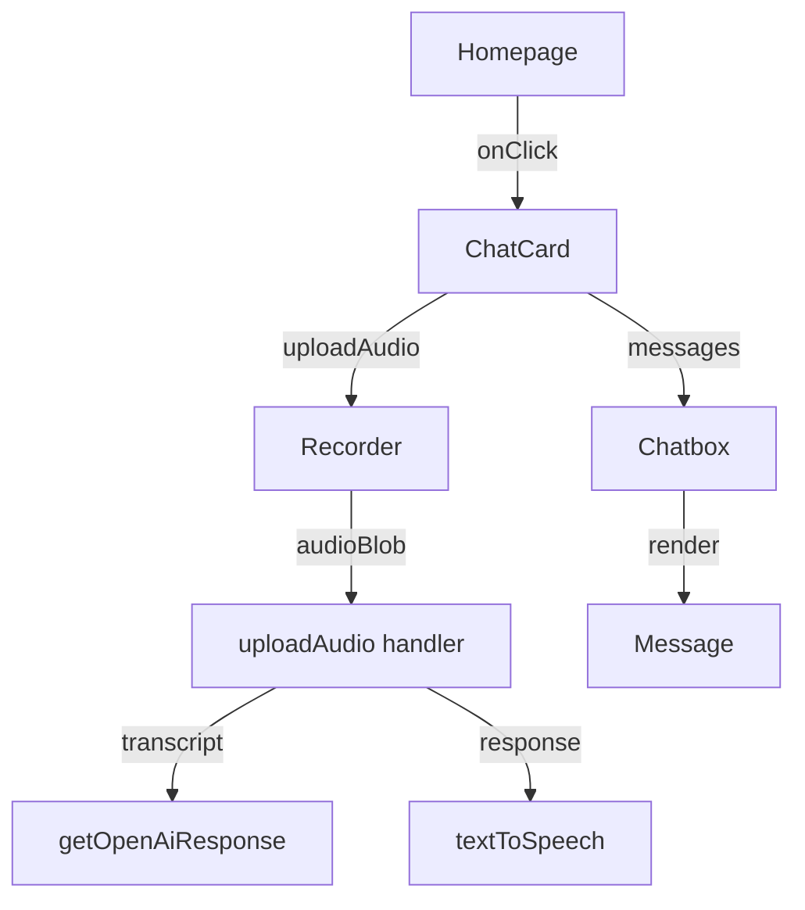

## Component Overview

EliteCode's UI is built with reusable React components organized into two main directories:

- **`src/components/`** - Page-level and feature components
- **`src/ion/`** - Reusable UI primitives and building blocks

## Core Components

### Homepage

**Location**: `src/components/ui/Homepage.tsx`

The main landing page component that displays the data structure topics in a bento grid layout.

<CodeGroup>
```tsx Component Structure
export function Homepage() {
  const [popup, setPopup] = useState<boolean>(false);
  const [topic, setTopic] = useState<string>("");
  const [activeIndex, setActiveIndex] = useState<number | null>(null);

  const handleClick = (title: string, index: number) => {
    setPopup(!popup);
    setTopic(title);
    setActiveIndex(index);
  };

  return (
    <div>
      <NavbarDemo />
      <BentoGrid className="max-w-4xl mx-auto">
        {items.map((item, i) => (
          <BentoGridItem
            key={i}
            title={item.title}
            description={item.description}
            header={item.header}
          />
        ))}
      </BentoGrid>
    </div>
  );
}
```

```tsx Topics Data
const items = [
  {
    title: "array",
    description: "contiguous memory storage for elements",
    header: <SkeletonThree imgSrc={"/array.gif"} />,
    className: "md:col-span-1",
  },
  {
    title: "linked list",
    description: "series of connected nodes",
    header: <SkeletonTwo />,
    className: "md:col-span-1",
  },
  // ... more topics
];
```
</CodeGroup>

**Key Features**:
- Interactive bento grid layout
- Modal popup management
- Topic-based learning modules
- Animated skeleton components for visual appeal

### Recorder

**Location**: `src/components/Recorder.tsx`

Handles audio recording using the browser's MediaRecorder API with real-time audio visualization.

<CodeGroup>
```tsx Props Interface
interface RecorderProps {
  uploadAudio: (blob: Blob) => Promise<void>;
  isRecording: boolean;
  toggleRecording: () => void;
}
```

```tsx Recording Logic
const startRecording = async () => {
  if (mediaRecorder === null || stream === null) return;
  
  const media = new MediaRecorder(stream, { mimeType: "audio/webm" });
  mediaRecorder.current = media;
  mediaRecorder.current.start();
  
  let localAudioChunks: Blob[] = [];
  mediaRecorder.current.ondataavailable = (event) => {
    if (typeof event.data === "undefined") return;
    if (event.data.size === 0) return;
    localAudioChunks.push(event.data);
  };
  setAudioChunks(localAudioChunks);
};
```

```tsx Stop Recording
const stopRecording = () => {
  mediaRecorder.current.stop();
  mediaRecorder.current.onstop = () => {
    const audioBlob = new Blob(audioChunks, { type: "audio/webm" });
    uploadAudio(audioBlob);
    setAudioChunks([]);
  };
};
```
</CodeGroup>

**Key Features**:
- Microphone permission handling
- Real-time audio visualization
- WebM audio format
- Animated recording states

### AudioVisualizer

**Location**: `src/components/Recorder.tsx:158`

A sub-component that provides real-time visual feedback during recording.

```tsx
export const AudioVisualizer: React.FC<AudioVisualizerProps> = ({
  audioStream,
  isRecording,
}) => {
  const canvasRef = useRef<HTMLCanvasElement>(null);
  const audioCtxRef = useRef<AudioContext | null>(null);

  useEffect(() => {
    if (!audioStream || !canvasRef.current) return;
    
    const audioCtx = new AudioContext();
    const analyser = audioCtx.createAnalyser();
    const source = audioCtx.createMediaStreamSource(audioStream);
    
    source.connect(analyser);
    analyser.fftSize = 256;
    
    const bufferLength = analyser.frequencyBinCount;
    const dataArray = new Uint8Array(bufferLength);
    
    // Draw frequency bars
    const drawBars = () => {
      analyser.getByteFrequencyData(dataArray);
      // Render bars on canvas...
    };
  }, [audioStream, isRecording]);

  return <canvas ref={canvasRef} className="w-800 h-100" />;
};
```

**Key Features**:
- Web Audio API integration
- Real-time frequency analysis
- Canvas-based visualization
- Responsive bar height based on audio level

### ChatCard (ModulePopup)

**Location**: `src/components/ModulePopup.tsx`

Modal component that manages the chat interface and coordinates audio recording, transcription, and AI responses.

```tsx
export const ChatCard: React.FC<{ onClose: () => void; topic: string }> = ({
  onClose,
  topic,
}) => {
  const [isRecording, setIsRecording] = useState(false);
  const [isLoading, setIsLoading] = useState<boolean>(false);
  const audioRef = useRef<HTMLAudioElement>(null);

  const uploadAudio = async (blob: Blob) => {
    setIsLoading(true);
    const formData = new FormData();
    formData.append("audio", blob, "audio.webm");
    
    try {
      // 1. Send to Whisper API
      const response = await fetch(
        `${process.env.NEXT_PUBLIC_API_URL}/whisper`,
        { method: "POST", body: formData }
      );
      const result = await response.json();
      const text = result?.results?.[0]?.transcript;
      
      // 2. Get OpenAI response
      const openAIResponse = await getOpenAiResponse(text);
      
      // 3. Convert to speech
      const ttsResponse = await textToSpeech(openAIResponse);
      
      // 4. Play audio
      if (audioRef.current && ttsResponse) {
        audioRef.current.src = ttsResponse.audio_url;
        audioRef.current.play();
      }
    } catch (error) {
      console.error("Error uploading file:", error);
    } finally {
      setIsLoading(false);
    }
  };

  return (
    <div className="fixed inset-0 z-50 bg-black bg-opacity-50">
      <div className="relative w-2/4 h-3/4 bg-white rounded-lg">
        <Chatbox messages={[]} />
        <Recorder
          uploadAudio={uploadAudio}
          isRecording={isRecording}
          toggleRecording={toggleRecording}
        />
        <audio ref={audioRef} controls style={{ visibility: "hidden" }} />
      </div>
    </div>
  );
};
```

**Workflow**:
1. Displays topic prompt
2. Manages recording state
3. Uploads audio to Whisper API
4. Sends transcript to OpenAI
5. Converts response to speech
6. Plays audio feedback

### Chatbox

**Location**: `src/ion/Chatbox.tsx`

Displays the conversation history between the user and AI.

```tsx
type ChatboxProps = {
  messages: MessageType[];
};

export const Chatbox = ({ messages }: ChatboxProps) => {
  const messagesEndRef = useRef<HTMLDivElement>(null);

  const scrollToBottom = () => {
    messagesEndRef.current?.scrollIntoView({ behavior: "smooth" });
  };

  useEffect(scrollToBottom, [messages]);

  return (
    <div className="pb-44 pt-20 containerWrap">
      {messages.map((message, index) => (
        <Message key={index} message={message} />
      ))}
      <div ref={messagesEndRef}></div>
    </div>
  );
};
```

**Key Features**:
- Auto-scroll to latest message
- Maps over message array
- Refs for scroll management

### BentoGrid

**Location**: `src/components/ui/Homepage.tsx:537`

Responsive grid layout for displaying data structure cards.

```tsx
export const BentoGrid = ({
  className,
  children,
}: {
  className?: string;
  children?: React.ReactNode;
}) => {
  return (
    <div
      className={cn(
        "grid md:auto-rows-[18rem] grid-cols-1 md:grid-cols-3 gap-4",
        className
      )}
    >
      {children}
    </div>
  );
};
```

**Features**:
- Responsive grid (1 column mobile, 3 columns desktop)
- Auto-sizing rows (18rem on desktop)
- Tailwind merge utility for className composition

### BentoGridItem

**Location**: `src/components/ui/Homepage.tsx:556`

Individual card component with hover effects.

```tsx
export const BentoGridItem = ({
  className,
  title,
  description,
  header,
}: {
  className?: string;
  title?: string | React.ReactNode;
  description?: string | React.ReactNode;
  header?: React.ReactNode;
}) => {
  return (
    <div
      className={cn(
        "row-span-1 rounded-xl group/bento hover:shadow-xl transition duration-200",
        "shadow-input dark:shadow-none p-2 dark:bg-black bg-white",
        className
      )}
    >
      {header}
      <div className="group-hover/bento:translate-x-2 transition duration-200">
        <div className="font-sans font-bold text-neutral-600">
          {title}
        </div>
        <div className="font-sans font-normal text-neutral-600 text-xs">
          {description}
        </div>
      </div>
    </div>
  );
};
```

**Features**:
- Hover animations (shadow and translate)
- Dark mode support
- Slot-based architecture (header, title, description)

## Animated Skeletons

The homepage uses various animated skeleton components for visual effects:

- **SkeletonOne** - Chat bubble animation
- **SkeletonTwo** - Linked list visualization
- **SkeletonThree** - Generic image display
- **SkeletonFour** - Sorting algorithm comparison
- **SkeletonFive** - Graph animation
- **SkeletonSix** - Search algorithm comparison
- **SkeletonSeven** - Stack/Queue visualization

All use Framer Motion for smooth animations:

```tsx
const variants = {
  initial: { x: 0 },
  animate: {
    x: 10,
    rotate: 5,
    transition: { duration: 0.2 }
  }
};

<motion.div
  initial="initial"
  whileHover="animate"
  variants={variants}
>
  {/* Content */}
</motion.div>
```

## API Integration Components

### OpenAI Integration

**Location**: `src/pages/api/openai.ts`

```typescript
import OpenAI from 'openai';

const openai = new OpenAI({
  apiKey: process.env.NEXT_PUBLIC_OPENAI_API_KEY || '',
  dangerouslyAllowBrowser: true
});

async function getOpenAiResponse(prompt: string): Promise<string> {
  const response = await openai.chat.completions.create({
    messages: [{
      role: 'user',
      content: "The user is explaining this topic, explain if it is a good explanation or not:" + prompt
    }],
    model: 'gpt-3.5-turbo',
    max_tokens: 50,
  });
  
  return response.choices[0].message.content ?? '';
}

export default getOpenAiResponse;
```

<Warning>
  The `dangerouslyAllowBrowser: true` flag allows client-side API calls. This exposes your API key in the browser. For production, move this to a server-side API route.
</Warning>

## Type Definitions

**Location**: `src/ion/types.tsx`

Contains TypeScript interfaces for messages and other shared types:

```typescript
export interface Message {
  id: string;
  role: 'user' | 'assistant';
  content: string;
  timestamp: Date;
}
```

## Component Best Practices

1. **State Management**: Use `useState` for local state, `useRef` for DOM references
2. **Props Typing**: Always define TypeScript interfaces for component props
3. **Event Handlers**: Use descriptive names like `handleClick`, `handleClose`
4. **Animations**: Leverage Framer Motion for smooth transitions
5. **Styling**: Use Tailwind utility classes with `cn()` helper for merging
6. **Accessibility**: Include proper ARIA labels and semantic HTML

## Component Communication


