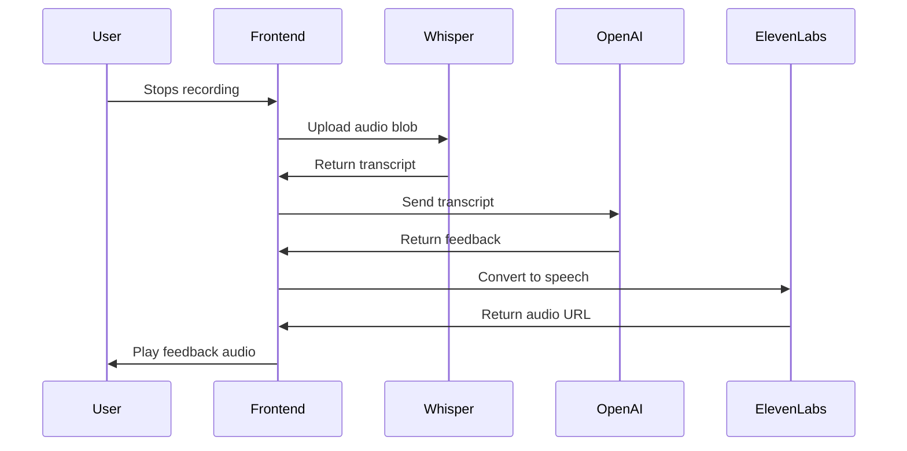

## Overview

EliteCode's AI feedback system evaluates user explanations of data structures and algorithms concepts using OpenAI's GPT models. The system provides immediate, intelligent feedback on explanation quality and comprehension.

## Architecture

The feedback pipeline consists of three stages:

<Steps>
  <Step title="Voice Transcription">
    User's spoken explanation is converted to text via Whisper AI
  </Step>
  
  <Step title="OpenAI Analysis">
    Transcribed text is analyzed by GPT-3.5-turbo for quality assessment
  </Step>
  
  <Step title="Audio Response">
    Feedback is converted to speech using ElevenLabs text-to-speech
  </Step>
</Steps>

## OpenAI Integration

### Client Configuration

The OpenAI client is configured with browser support:

```typescript openai.ts
import OpenAI from 'openai';

const openai = new OpenAI({
  apiKey: process.env.NEXT_PUBLIC_OPENAI_API_KEY || '',
  dangerouslyAllowBrowser: true
});
```

<Warning>
**Security Note**: Using `dangerouslyAllowBrowser: true` exposes the API key in client-side code. For production, move this to a secure backend API route.
</Warning>

### Feedback Generation

The core feedback function analyzes explanations:

```typescript openai.ts
async function getOpenAiResponse(prompt: string): Promise<string> {
  let openAiResponse;
  openAiResponse = await openai.chat.completions.create({
    messages: [
      { 
        role: 'user', 
        content: "The user is explaining this topic, explain if it is a good explanation or not:" + prompt 
      }
    ],
    model: 'gpt-3.5-turbo',
    max_tokens: 50,
  });

  const completionResult = await openAiResponse
  
  return completionResult.choices[0].message.content ?? '';
}

export default getOpenAiResponse;
```

### Model Parameters

| Parameter | Value | Purpose |
|-----------|-------|----------|
| `model` | `gpt-3.5-turbo` | Fast, cost-effective conversational model |
| `max_tokens` | `50` | Concise feedback (approximately 30-40 words) |
| `role` | `user` | Single-turn conversation format |
| `content` | Custom prompt | Instructs model to evaluate explanation quality |

<Info>
The 50-token limit ensures feedback is brief and focused, maintaining user engagement during voice interaction.
</Info>

## Prompt Engineering

### Evaluation Prompt Structure

The system uses a specific prompt format:

```
"The user is explaining this topic, explain if it is a good explanation or not: [USER_EXPLANATION]"
```

This prompt structure:
- **Sets context**: Establishes that user is providing an explanation
- **Defines task**: Instructs model to evaluate explanation quality
- **Includes content**: Appends the transcribed user explanation

<Tip>
**Prompt Optimization**: Consider enhancing the prompt with:
- Specific evaluation criteria (accuracy, completeness, clarity)
- Topic context from the selected module
- Grading rubric or scoring system
</Tip>

## Text-to-Speech Integration

### ElevenLabs Configuration

Feedback is converted to natural-sounding speech:

```typescript textToSpeech.ts
async function textToSpeech(text: string, voiceId: string = 'eYO9Ven76ACQ8Me4zQK4') {
  const options = {
    method: 'POST',
    headers: {
      'xi-api-key': process.env.NEXT_PUBLIC_ELEVEN_API_KEY || '',
      'Content-Type': 'application/json'
    },
    body: JSON.stringify({
      model_id: "eleven_multilingual_v2",
      text: text,
      voice_settings: {
        similarity_boost: 0.9,
        stability: 1
      }
    })
  };

  try {
    const response = await fetch(
      `https://api.elevenlabs.io/v1/text-to-speech/${voiceId}?output_format=mp3_22050_32`,
      options
    );

    if (response.ok && response.headers.get("content-type")?.includes("audio")) {
      const audioBlob = await response.blob();
      const audioUrl = URL.createObjectURL(audioBlob);
      return { audio_url: audioUrl };
    } else {
      throw new Error('Network response was not ok or the content type is not audio');
    }
  } catch (err) {
    console.error(err);
    return null;
  }
}

export default textToSpeech;
```

### Voice Settings

<CardGroup cols={2}>
  <Card title="Similarity Boost" icon="waveform">
    Set to `0.9` for high voice consistency with the selected voice model
  </Card>
  
  <Card title="Stability" icon="gauge-high">
    Set to `1.0` for maximum stability and predictable pronunciation
  </Card>
  
  <Card title="Model" icon="language">
    `eleven_multilingual_v2` supports multiple languages and accents
  </Card>
  
  <Card title="Output Format" icon="file-audio">
    `mp3_22050_32` balances quality and file size (22.05kHz, 32kbps)
  </Card>
</CardGroup>

## Complete Feedback Flow

Here's how the entire system works together:

```typescript ModulePopup.tsx
const uploadAudio = async (blob: Blob) => {
  setIsLoading(true);
  const formData = new FormData();
  formData.append("audio", blob, "audio.webm");
  
  try {
    // Step 1: Transcribe audio with Whisper
    const response = await fetch(
      `${process.env.NEXT_PUBLIC_API_URL}/whisper`,
      {
        method: "POST",
        body: formData,
      }
    );

    if (!response.ok) throw new Error("Network response was not ok");
    const result = await response.json();

    const text =
      result?.results?.[0]?.transcript ??
      "Could not hear user, prompt an error message.";

    // Step 2: Get AI feedback on explanation
    const openAIResponse = await getOpenAiResponse(text);

    // Step 3: Convert feedback to speech
    const ttsResponse = await textToSpeech(openAIResponse);
    
    if (ttsResponse) {
      const audioPlayer = audioRef.current;
      if (audioPlayer) {
        audioPlayer.src = ttsResponse.audio_url;
        audioPlayer
          .play()
          .catch((error) => console.error("Error playing audio:", error));
      }
    }
  } catch (error) {
    console.error("Error uploading file:", error);
  } finally {
    setIsLoading(false);
  }
};
```

### Processing Timeline



<Note>
Total processing time typically ranges from 2-5 seconds depending on audio length and API response times.
</Note>

## Error Handling

### Transcription Fallback

If Whisper fails to transcribe:

```typescript
const text = result?.results?.[0]?.transcript ?? 
  "Could not hear user, prompt an error message.";
```

The system sends a fallback message to OpenAI, which will prompt the user to try again.

### OpenAI Error Handling

```typescript
return completionResult.choices[0].message.content ?? '';
```

Returns empty string if no response is generated, preventing application crashes.

### Audio Playback Errors

```typescript
audioPlayer
  .play()
  .catch((error) => console.error("Error playing audio:", error));
```

<Warning>
Common playback errors:
- **Browser autoplay policy**: User must interact with page first
- **Invalid audio format**: Ensure proper MP3 encoding
- **Network issues**: Handle slow or failed audio downloads
</Warning>

## Alternative Implementation (Server-Side)

The codebase includes an alternative server-side approach:

```typescript transcript.ts
let openAiResponse;
try {
  openAiResponse = await fetch("https://api.openai.com/v1/completions", {
    method: "POST",
    headers: {
      "Content-Type": "application/json",
      Authorization: `Bearer ${process.env.NEXT_PUBLIC_OPENAI_API_KEY}`,
    },
    body: JSON.stringify({
      model: "text-davinci-003",
      prompt: transcription.text,
      temperature: 0.5,
      max_tokens: 100,
      top_p: 1.0,
      frequency_penalty: 0.0,
      presence_penalty: 0.0,
    }),
  });
} catch (error) {
  console.error("Error fetching from OpenAI API:", error);
  return;
}

const completionResult = await openAiResponse.json();
console.log("OpenAI completion:", completionResult.choices[0].text);
```

This approach:
- Uses the older completions API with `text-davinci-003`
- Processes entire transcription as a prompt
- Allows 100 tokens for longer responses
- Provides more advanced parameters (temperature, frequency_penalty)

<Tip>
**Migration Recommendation**: The server-side approach is more secure but requires updating to the Chat Completions API (`gpt-3.5-turbo` or `gpt-4`) as the legacy Completions API is deprecated.
</Tip>

## Performance Optimization

### Token Management

```typescript
max_tokens: 50  // Approximately $0.00008 per request at GPT-3.5-turbo pricing
```

Limiting tokens reduces:
- API costs
- Response latency
- Text-to-speech duration

### Streaming Responses

For future enhancement, consider streaming:

```typescript
const stream = await openai.chat.completions.create({
  messages: [{ role: 'user', content: prompt }],
  model: 'gpt-3.5-turbo',
  stream: true,
});

for await (const chunk of stream) {
  process.stdout.write(chunk.choices[0]?.delta?.content || '');
}
```

Streaming provides:
- Faster time-to-first-token
- Progressive user feedback
- Better perceived performance

## Future Enhancements

<AccordionGroup>
  <Accordion title="Context-Aware Feedback">
    Enhance prompts with:
    - Selected topic name (Array, Stack, etc.)
    - Expected key concepts for the topic
    - Previous conversation history
    - User's learning level/progress
  </Accordion>
  
  <Accordion title="Structured Evaluation">
    Request JSON-formatted responses:
    ```json
    {
      "score": 8,
      "strengths": ["Clear explanation of concept"],
      "improvements": ["Could mention time complexity"],
      "feedback": "Good explanation overall..."
    }
    ```
  </Accordion>
  
  <Accordion title="Multi-Turn Conversations">
    Maintain conversation history:
    - Ask follow-up questions
    - Probe deeper understanding
    - Provide targeted hints
    - Build on previous explanations
  </Accordion>
  
  <Accordion title="Adaptive Difficulty">
    Adjust evaluation criteria based on:
    - User's demonstrated knowledge level
    - Topic complexity
    - Number of attempts
    - Learning progress over time
  </Accordion>
</AccordionGroup>

## API Cost Considerations

### Current Usage

| Service | Model | Cost per Request | Estimated Monthly Cost (1000 users) |
|---------|-------|------------------|-------------------------------------|
| OpenAI | GPT-3.5-turbo | ~$0.00008 | ~$80 |
| ElevenLabs | Multilingual V2 | ~$0.015 per 1000 chars | ~$150 |
| Whisper | Base model | Self-hosted | Infrastructure only |

<Info>
**Cost Optimization**: Consider implementing request caching for common explanations or using fine-tuned models for topic-specific evaluation.
</Info>

## Related Features

<CardGroup cols={2}>
  <Card title="Voice Interaction" icon="microphone" href="/features/voice-interaction">
    Learn how audio is captured and transcribed
  </Card>
  
  <Card title="Learning Modules" icon="book-open" href="/features/learning-modules">
    Discover the interactive topic selection interface
  </Card>
</CardGroup>